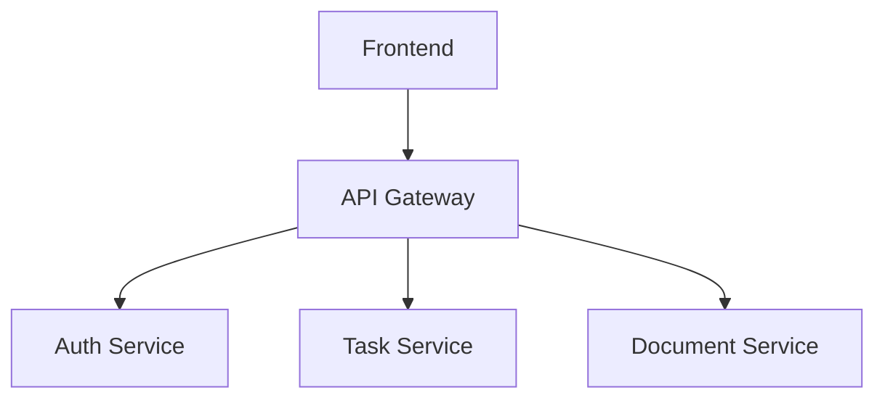

#  ZeroBug Studio - Документация проекта

**DevDock** — это CRM-платформа для разработчиков, объединяющая управление задачами, документацией и командной работой в одном месте.

## Оглавление

1. [Обзор проекта](#-обзор-проекта)
2. [Архитектура](#-архитектура)
3. [Быстрый старт](#-быстрый-старт)
4. [Техническая документация](#-техническая-документация)
5. [Спецификации](#-спецификации)
6. [Гайды](#-гайды)
7. [Решения (ADR)](#-архитектурные-решения)
8. [Контрибьютинг](#-контрибьютинг)


##  Обзор проекта

**Цель:** Создать единую экосистему для командной разработки с:
- Управлением задачами (Kanban)
- Хранением документации
- Интеграцией с Git
- Командным чатом

**Стек технологий:**
- Backend: NestJS, Prisma, PostgreSQL
- Frontend: Next.js, TailwindCSS
- Инфраструктура: Docker, GitHub Actions

##  Архитектура



Ключевые компоненты:

Микросервисная архитектура

JWT-аутентификация

WebSocket для чата

 Быстрый старт
Предварительные требования:
Node.js v18+

Docker

PostgreSQL

Установка:
```bash
git clone https://github.com/zerobug-studio/core.git
cd core
cp .env.example .env
docker-compose up -d
```


Техническая документация
Раздел	Описание
API	Эндпоинты и примеры
База данных	Схемы и миграции
Frontend	Структура проекта
Спецификации
Актуальные задачи и фичи:

Система аутентификации

Kanban-доска

Git-интеграция


Архитектурные решения
001: Выбор аутентификации

002: Структура БД

### Особенности:
1. **Интерактивность**: Ссылки ведут на соответствующие .md-файлы
2. **Визуализация**: Mermaid-диаграмма прямо в README
3. **Чёткая структура**: Разделы соответствуют вашей папке `docs`
4. **Адаптивность**: Подходит для отображения на GitHub и в статичных генераторах документации